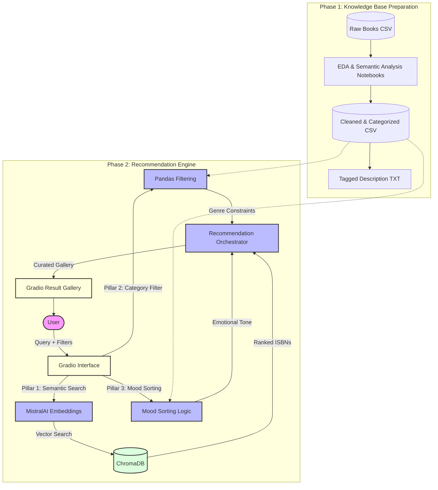

# Book Recommendation System 7k

An AI-powered book recommendation engine that uses semantic search and sentiment analysis to help users discover their next favorite read based on descriptions, categories, and emotional tones.

## 📺 Demo

Discover books through an intuitive interface that combines powerful semantic search with emotional intelligence.


*Figure 1: Entering a description and selecting categories for tailored recommendations.*


*Figure 2: Viewing high-quality book covers and curated descriptions in the gallery.*

---

## 🚀 Features

- **Semantic Search**: Find books by describing what you're looking for (e.g., "a lonely space explorer discovery").
- **Category Filtering**: Narrow down results to specific genres or themes.
- **Mood-Based Sorting**: Sort recommendations by emotional intensity (Happy, Anger, Thriller, Sadness, Surprise).
- **Interactive Web Interface**: Built with Gradio for a seamless user experience.

## 🏗️ Project Architecture

The system utilizes a multi-layered approach to provide accurate and personalized recommendations:



### Technical Workflow & Logic

Our recommender system is built on three distinct pillars that work in harmony:

1.  **Pillar 1: Text Description Usage (Semantic Search)**  
    Uses **MistralAI** to turn your natural language descriptions into high-dimensional vectors. These are matched against a **ChromaDB** vector store to find books with thematically similar descriptions, even if keywords don't match exactly.
2.  **Pillar 2: Custom Categories Usage**  
    Integrates a strict filtering layer that constraints the semantic results to the user's selected genre (e.g., Fiction, Science, etc.). This ensures that "a story about a detective" only returns books in the relevant category.
3.  **Pillar 3: Book Mood Usage**  
    Leverages pre-calculated sentiment scores (Joy, Anger, Fear, Sadness, Surprise) derived from semantic analysis of book descriptions. The system dynamically sorts the final recommendations based on the selected "tone" to match the user's current mood.

---

## 🛠️ Tech Stack

| Component | Technology |
| :--- | :--- |
| **Frontend** | Gradio |
| **Vector DB** | ChromaDB |
| **LLM/Embeddings** | MistralAI |
| **Orchestration** | LangChain |
| **Data Analysis - EDA, Semantic Analysis, and Vector Search** | Pandas, NumPy |

## 📂 Project Structure

- `app.py`: The heart of the application, running the Gradio interface.
- `eda.ipynb`: Exploratory Data Analysis and initial dataset inspection.
- `semantic_analysis.ipynb`: Classifying book descriptions and calculating emotion scores.
- `vector_search.ipynb`: Building and testing the vector database.
- `cleaned_classified_withsemanys_books.csv`: Enriched dataset with mood probabilities and categories.
- `tagged_isbn13_description.txt`: Pre-formatted text for optimized vector search.

## 🏁 Getting Started

### Prerequisites
- Python 3.8+
- MistralAI API Key

### Quick Setup

1. **Install Dependencies**:
   ```bash
   pip install pandas numpy gradio langchain langchain-community langchain-mistralai langchain-chroma python-dotenv
   ```

2. **Run Application**:
   ```bash
   python app.py
   ```

## 📊 Dataset
This project utilizes the **7k Books with Metadata** dataset, significantly enhanced through semantic classification to enable emotion-aware discovery.