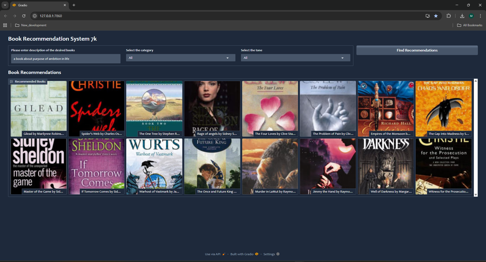
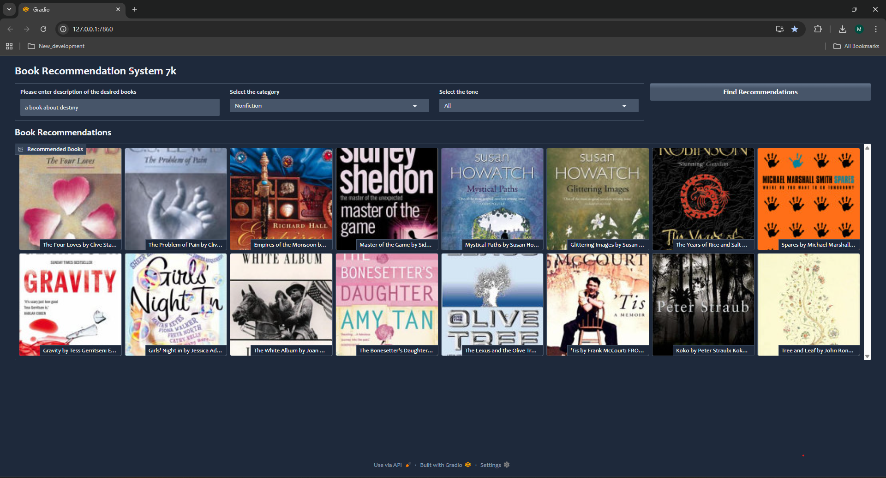
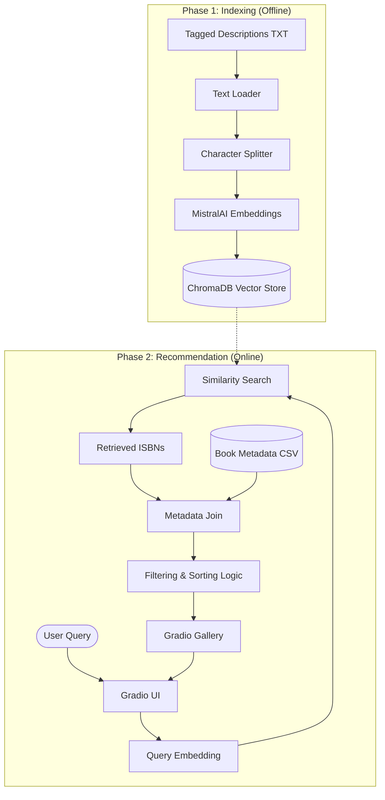

# Book Recommendation System 7k

An AI-powered book recommendation engine that uses semantic search and sentiment analysis to help users discover their next favorite read based on descriptions, categories, and emotional tones.

## 📺 Demo

Discover books through an intuitive interface that combines powerful semantic search with emotional intelligence.


*Figure 1: Entering a description and selecting categories for tailored recommendations.*


*Figure 2: Viewing high-quality book covers and curated descriptions in the gallery.*

---

## 🚀 Features

- **Semantic Search**: Find books by describing what you're looking for (e.g., "a story about destiny and self-discovery").
- **Category Filtering**: Narrow down results to specific genres (Fiction, Self-Help, Science, etc.).
- **Mood-Based Sorting**: Sort recommendations by emotional intensity (**Happy**, **Anger**, **Thriller**, **Sadness**, **Surprise**).
- **Interactive Interface**: Sleek web UI built with [Gradio](https://gradio.app/) with a glassmorphism theme.
- **Dynamic Previews**: View book covers, authors, and truncated descriptions at a glance.

## 🏗️ Project Architecture

The system follows a Retrieval-Augmented Generation (RAG) inspired architecture for semantic search:



### Technical Workflow
1.  **Vector Store Initialization**: A pre-processed file (`tagged_isbn13_description.txt`) is indexed into **ChromaDB** using **MistralAI Embeddings**.
2.  **Semantic Retrieval**: Similarity search retrieves the most relevant book IDs based on user input.
3.  **Metadata Enrichment**: Joins results with the primary dataset (`cleaned_classified_withsemanys_books.csv`) for full metadata.
4.  **Filtering & Sorting**: Applies category constraints and mood-based ranking (e.g., sorting by 'joy' for "Happy" tone).
5.  **Gallery Rendering**: Formats and displays results in an 8-column responsive gallery.

## 🛠️ Tech Stack

| Component | Technology |
| :--- | :--- |
| **Frontend** | Gradio |
| **Vector DB** | ChromaDB |
| **LLM/Embeddings** | MistralAI |
| **Orchestration** | LangChain |
| **Data Analysis -EDA, Semantic Analysis, and Vector Search** | Pandas, NumPy |

## 📂 Project Structure

- `app.py`: The heart of the application, running the Gradio interface.
- `eda.ipynb`: Exploratory Data Analysis and initial dataset inspection.
- `semantic_analysis.ipynb`: Classifying book descriptions and calculating emotion scores.
- `vector_search.ipynb`: Building and testing the vector database.
- `cleaned_classified_withsemanys_books.csv`: Enriched dataset with mood probabilities and categories.
- `tagged_isbn13_description.txt`: Pre-formatted text for optimized vector search.

## 🏁 Getting Started

### Prerequisites
- Python 3.8+
- MistralAI API Key

### Quick Setup

1. **Install Dependencies**:
   ```bash
   pip install pandas numpy gradio langchain langchain-community langchain-mistralai langchain-chroma python-dotenv
   ```

2. **Run Application**:
   ```bash
   python app.py
   ```

## 📊 Dataset
This project utilizes the **7k Books with Metadata** dataset, significantly enhanced through semantic classification to enable emotion-aware discovery.